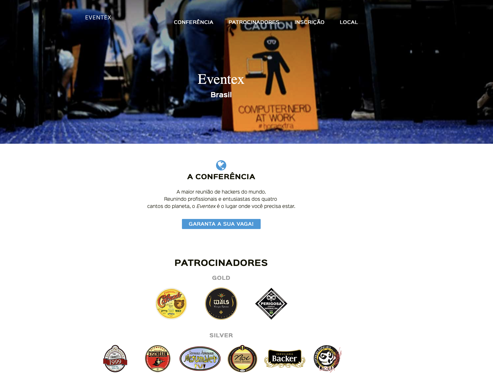

# Eventex


>this project is all manageable, from the layout to the information, I used the django dashboard to manage the registration for the event

## Installation

OS X ,Linux & Windows:

```sh
  git clone https://github.com/digomes87/wttd-eventex.git
```

## How to Development

```sh
1 - Git clone this repo<br>
2 - Building the venv with python 3.5<br>
3 - Active .venv<br>
4 - Install requirements.txt<br>
5 - Run the test -> python manager.py test<br>
```

For generate secret key has inside contrib a file python, scret_gen_file<br>
Just runner in terminal and copy ;)


## About Me

Diego Go – [Twitter](https://twitter.com/@DevDiegoGo) 


Contact - [Email: diego.gomes87@gmail.com](diego.gomes87@gmail.com)


Github [https://github.com/digomes87](https://github.com/digomes87/) 

See Here this project [https://github.com/digomes87/wttd-eventex](Bike)

Version for preview [https://eventex-diego.herokuapp.com] (Eventex In heroku)

## Contributing

Fork it (<https://github.com/digomes87/bike>)

